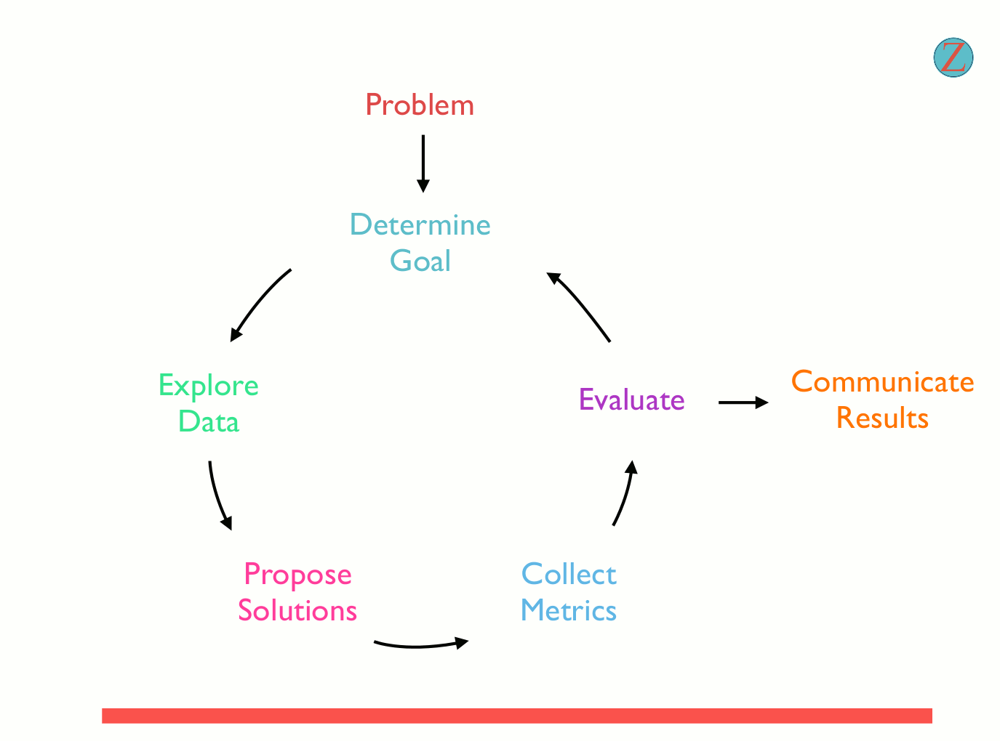

# Project-Wrangle-and-Analyze-Data

# Problem Statement:

### Data wrangling process using Python to gather, assess, and clean data programmatically for deeper analysis.

## Data sources

This project involves the data wrangling work for Data collected from WeRateDogs tweeter handle.

    
[Dataset1](https://github.com/abel-keya/Project-Wrangle-and-Analyze-Data/blob/master/twitter_archive_master.csv)

[Dataset2](https://github.com/abel-keya/Project-Wrangle-and-Analyze-Data/blob/master/image-predictions.tsv)

[Dataset3](https://github.com/abel-keya/Project-Wrangle-and-Analyze-Data/blob/master/twitter_json.txt)

# Description

In this project it is required to:

(i) Gather data;

From at least the three (3) different sources in at least the three (3) different file formats on the Project Details page. Each piece of data is imported into a separate pandas DataFrame at first.

(ii)Assess the data using;

Visual assessment and Programmatic assessment. it is required to detect atleast eight (8) data quality issues and two (2) tidiness issues, and include the issues to clean to satisfy the Project Motivation. Each issue is documented in one to a few sentences each.

(iii) Cleaning data

by applying the steps define, code, and test

(iv)Save the master dataset at the end of cleaning process

(v)Analyze the data to give insights

The master dataset is analyzed using pandas or SQL in the Jupyter Notebook and at least three (3) separate insights are produced and create atleast one (1) labeled visualization is produced in the Jupyter Notebook using Python’s plotting libraries or in Tableau.

# Context

The dataset wrangled was obtained from the tweet archive of Twitter user @dog_rates, also known as WeRateDogs. WeRateDogs is a Twitter account that rates people's dogs with a humorous comment about the dog. These ratings almost always have a denominator of 10. The numerators, though? Almost always greater than 10. 11/10, 12/10, 13/10, etc. Why? Because "they're good dogs Brent." WeRateDogs has over 4 million followers and has received international media coverage.

# Requirements

* Anaconda installation
* Google colab
* requests
* tweepy
* json
*  Sublime

* Setup instruction

> * Save a copy of the notebook in your drive and open it to access.

   
   # Technologies used:
   
 
 
   
  
 

# Support
In case of any clarifications or suggestions with regards to this project email me at jumakeya@gmail.com

License
Copyright (c) 2020 **Abel Keya**
